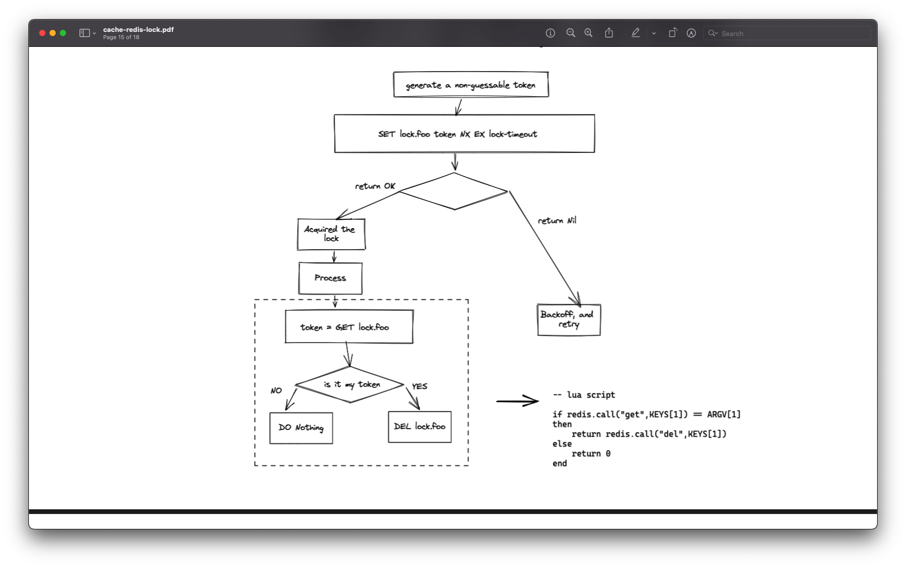

# Simple-Redis-Lock

A simple lock with Redis implemented with the pattern: https://redis.io/commands/set/.
It **does not** aim to have a fault tolerant solution like [redlock](https://redis.com/redis-best-practices/communication-patterns/redlock/).

## Motivation

This library was built to throttle the redundant queries from original server for a cache mechanism, the fault tolerance is not a matter because the worst case of losing
the lock is just bringing some extra queries.

It provides deadlock prevention with an auto-release mechanism, and handles releasing conflicts with a lua script.
There are only two interfaces(or public functions) for this module.

- acquire
- release

The main flow can be depicted as follows,


### Eval vs EvalSha

The relesae of lock relies on a lua script to conduct an atomic check of the owner of lock.
The `eval` command sends the script body again and again to Redis, to save some bandwidth, this library uses `evalSha` to run the lua script.
Consequently there are some extra handlings for the load of script; basically it blindly calls the `evalSha` assuming the script is there and catches the `NOSCRIPT`
error and refreshes the sha when needed.

## Install

```sh
$ npm install @xavierchow/simple-redis-lock
```

## Usage

```javascript
import Redis from 'ioredis';
import { acquire } from '@xavierchow/simple-redis-lock';

const redis = new Redis();
const ttlInSec = 10;
const lock = await acquire(redis, resource, ttlInSec);
if (lock) {
  try {
    // some processing here
  } finally {
    await lock.release();
  }
}
```

## development

```sh
# start redis with docker
$ ./dockers.sh

# run the test
$ npm test

```

## License

MIT
